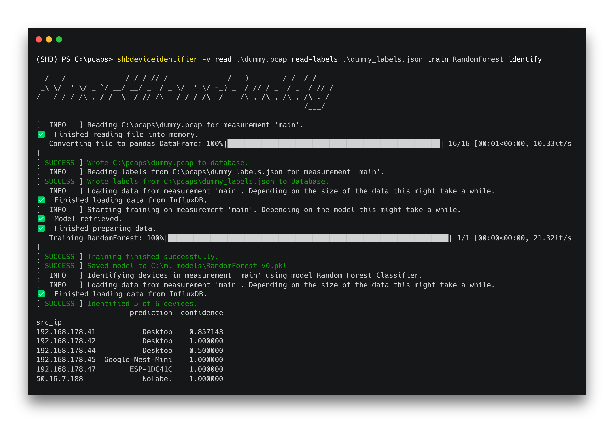
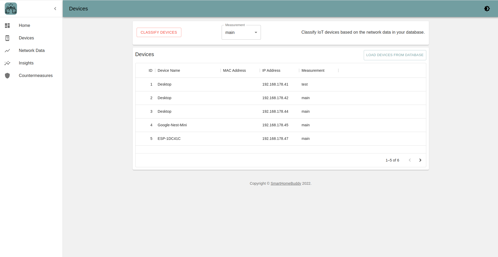

  

SmartHomeBuddy is a desktop application that allows you to identify smart home devices in your home network.
It is extensible with custom Machine Learning models for classification and provides countermeasures to secure your
home. It aims to be a simple and intuitive application, while also offering an infrastructure for interested
contributors to enhance its functionality to identify, analyze and protect home networks.

### Get Started

Download our latest release and try out the GUI or the CLI.

  

  

### Documentation

Further documentation is available on [Read the Docs](https://smarthomebuddy.readthedocs.io/).

### License

©️ Tobias Becher and Johannes Jestram. Licensed
under [GPLv3](https://github.com/jo-jstrm/SmartHomeBuddy/blob/main/LICENSE).