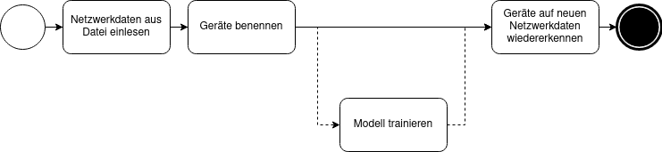

Workflow
--------

The basic workflow consists of the following steps:

#. Reading data from a file
#. Assign names to IP addresses
#. (Optional) Train a model to recognize the devices
#. Read new data from another file
#. Identify the devices within the new data

CLI Workflow
~~~~~~~~~~~~

First, read a file with the ``read`` command.
This will add the network data to SmartHomeBuddy's database.
Depending on the size of the data, this can take a while.
The option ``measurement`` is not mandatory, but we recommend using it on order better structure your data.
If you leave ``measurement`` empty, it will default to ``main``.
Note that one IP address should always belong to the same device within one measurement.
If you insert data from multiple networks, where the same IP address might belong to different devices, you should use different measurements.

.. code-block:: bash

    shbdeviceidentifier read --measurement "train-data" path/to/file.pcap

Then read a file that contains the names for the IP addresses contained in the network data.

.. code-block:: bash

    shbdeviceidentifier read-labels --measurement "train-data" path/to/labels.json

The labels must be formatted as follows:

.. code-block:: json

  {
    "192.168.178.41": {
      "name": "Desktop"
    },
    "192.168.178.45": {
      "name": "Google-Nest-Mini"
    },
    "192.168.178.44": {
      "name": "Google-Nest-Mini"
    },
  }

Next, a user might want to train a model to recognize the devices.
We will use the data that we just read.

.. code-block:: bash

    shbdeviceidentifier train --measurement "train-data"

Now, we can read new data and identify it.

.. code-block:: bash

    shbdeviceidentifier read --measurement "new-data" path/to/file.pcap

.. code-block:: bash

    shbdeviceidentifier identify --measurement "new-data"