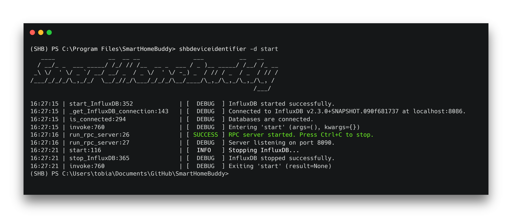

.. title:: SmartHomeBuddy

=============================

SmartHomeBuddy is a desktop application that allows you to identify smart home devices in your home network.
It is extensible with custom Machine Learning models for classification and provides countermeasures to secure your
home. It aims to be a simple and intuitive application, while also offering an infrastructure for interested
contributors to enhance its functionality to identify, analyze and protect home networks.

Quick links
-----------

* Current version: |version| (`download from GitHub <https://github.com/jo-jstrm/SmartHomeBuddy/releases>`_, :doc:`release notes <releases>`)
* `Source (GitHub) <https://github.com/jo-jstrm/SmartHomeBuddy>`_

Get Started
------------

GUI
~~~

Select the correct binary for your system from `GitHub <https://github.com/jo-jstrm/SmartHomeBuddy/releases>`_ and install it.
You should then be able to start the application.

CLI
~~~~

The command line interface shbdeviceidentifier requires Python 3.8 or higher.
You can start by installing the application by running the following command from the main directory of the repository:

.. code-block:: bash

    cd device-identifier

.. code-block:: bash

    pip install -r requirements.txt

And for example:

.. code-block:: bash

    shbdeviceidentifier start

The result should look something like this:

A list of available commands can be found by running the following command:

.. code-block:: bash

    shbdeviceidentifier --help

Documentation
-------------

.. toctree::
   :titlesonly:

   guide
   releases
   modules

..
   * :ref:`genindex`
   * :ref:`modindex`
   * :ref:`search`

Discussion and support
----------------------

You can report bugs on the `GitHub issue tracker
<https://github.com/jo-jstrm/SmartHomeBuddy/issues>`_.

SmartHomeBuddy is available under
the `GNU General Public License v3.0
<https://github.com/jo-jstrm/SmartHomeBuddy/blob/main/LICENSE>`_.

This website and all documentation is licensed under `Creative
Commons 3.0 <https://creativecommons.org/licenses/by/3.0/>`_.